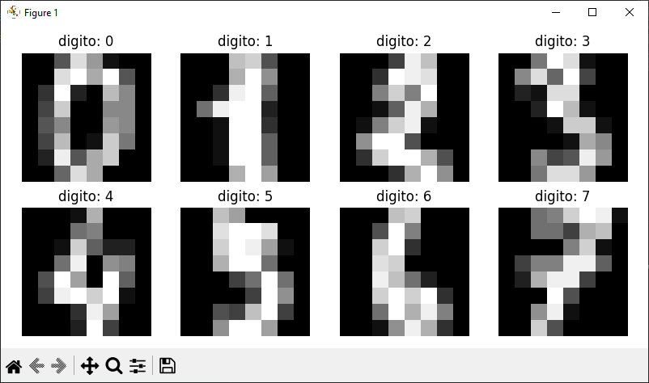
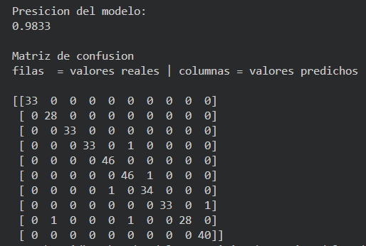

# Modelo: Red Neuronal Multicapa (MLPClassifier)

## Objetivo de la práctica

Comprender y aplicar el modelo conexionista mediante una Red Neuronal Artificial (RNA) para clasificar imágenes de dígitos escritos a mano, utilizando la base de datos Digits disponible en scikit-learn.

## Instrucciones paso a paso

Importa las librerías necesarias: numpy, matplotlib, sklearn.
Carga la base de datos con load_digits().
Visualiza algunas imágenes para familiarizarte con los datos.
Divide los datos en entrenamiento (80%) y prueba (20%).
Crea un modelo de red neuronal multicapa con MLPClassifier.
Entrena la red con los datos de entrenamiento.
Evalúa el modelo con el conjunto de pruebas.
Calcula la precisión y genera una matriz de confusión.
Reflexiona sobre los resultados:
¿Qué tan preciso fue el modelo?
¿Dónde se equivocó más?
¿Cómo cambian los resultados si modificas el número de capas y neuronas?

## Librerias utilizadas

- `numpy`
- `matplotlib`
- `scikit-learn`

## Resultados

- El modelo clasifica correctamente la mayoría de los dígitos.
- Los errores se presentan principalmente entre dígitos visualmente similares como:
  - 3 y 5
  - 8 y 9
  - 1 y 7

### Visualizacion de los dígitos
La siguiente imagen muestra algunos ejemplos de dígitos manuscritos del dataset Digits:

En la siguiente imagen se muestra la salida del programa en la terminal, incluyendo la **precisión del modelo** y la **matriz de confusión**:

