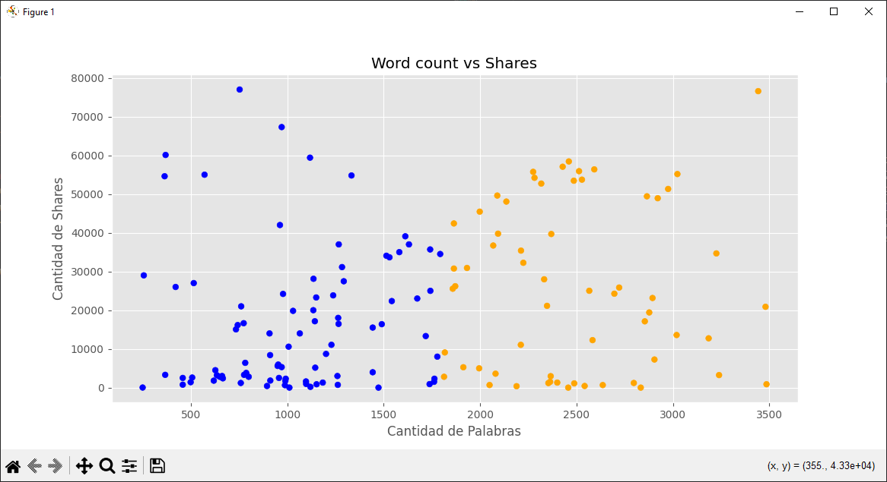
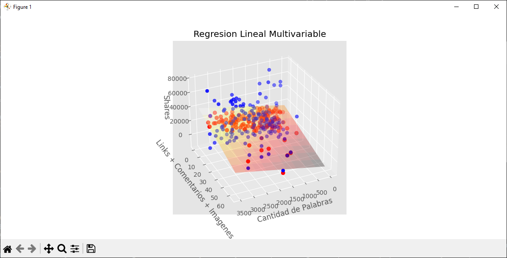
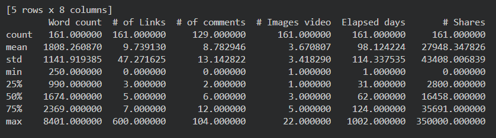

# Práctica de Regresión Lineal

## Librerias a utilizar

- **NumPy**: Manejo de datos y operaciones numericas
- **Matplotlib**: Visualizacion de datos
- **Scikit-learn**: Implementacion del modelo de regresion lineal
- **Pandas**: Carga y manipulacion de datos

## Dataset

El archivo utilizado es articulos_ml.csv, el cual contiene informacion sobre articulos relacionados con tecnologia e inteligencia artificial.

## Limpieza de Datos

Se realiza un preprocesamiento del dataset para:
- Reemplazar valores nulos por cero
- Eliminar valores extremos
- Filtrar registros con:
- Menos de 3500 palabras
- Menos de 80000 compartidos

## Visualizacion

- Grafica 2D para la regresion lineal simple
- Grafica 3D para la regresion multivariable
- Se visualiza el plano de regresion y los puntos reales y predichos

## Resultados Obtenidos

A continuacion se muestran algunas imagenes generadas durante la ejecucion del programa, donde se observa el comportamiento de los datos y el resultado de los modelos de regresion lineal.

### Grafica de Regresion Lineal Simple

### Grafica de Regresion Lineal Multivariable

### Resultados en Terminal

## Conlusion

- La regresion lineal simple muestra una relacion limitada entre la cantidad de palabras y los compartidos

- La regresion multivariable mejora el modelo al considerar mas factores

- La cantidad de compartidos depende de multiples variables, no solo del contenido del texto